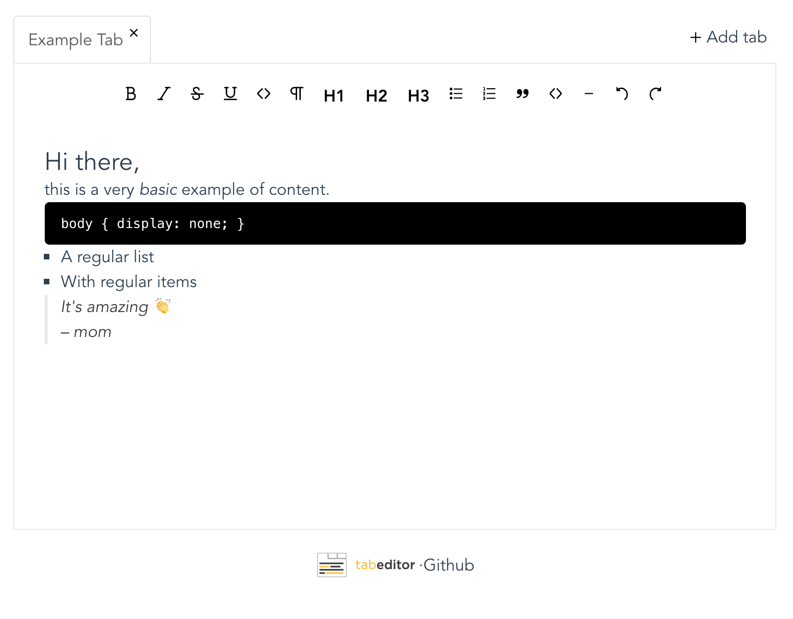

# tabeditor

tabeditor has a very simple purpose: use your **new** tab (cmd + t/ctrl + t) of your browser to take notes, write down tasks or actually do anything that you want.

## Features

- **Tabs**: Yeah, surprise. Tabeditor has tabs. I mean, tabs inside your "new page" tab, so you can organize yourself a little better
- **Offline** support: yep, of course even if you are offline, tabeditor will work
- **Persisted State**: Close without any fear that tab. The next time that you open it, it will have all your content there. Right now, the information is saved locally, so don't clear your localStorage.
- **Shared Tabs**: Open multiple "new" tabs on your browser. All off them will share the same content. It doesn't matter where do you write, the content will be always the same

## Extension install

Download the [Google Chrome extension](https://chrome.google.com/webstore/detail/tabeditor/pkibnlkcaddedalckanlbglaaifomljg)

or

- Navigate to `chrome://extensions`
- Expand the Developer dropdown menu and click “Load Unpacked Extension”
- Compile the project `yarn install && yarn build`
- Navigate to the local folder containing the extension’s code, select the `dist` folder and click Ok

## Upcoming / desired

- Add Firefox version
- Organize / edit title of the tabs
- Online sync between devices
- Fancy animations
- Remove vue-nav-tabs dependency and create my own tabs

## Credits

- [Tiptap Rich-text](https://github.com/scrumpy/tiptap) editor by scrumpy
- [Vue tabs](https://github.com/cristijora/vue-tabs) by critijora
- [Vuex persisted state](https://github.com/robinvdvleuten/vuex-persistedstate) by robinvdvleuten
- [Vuex shared mutations](https://github.com/xanf/vuex-shared-mutations) by xanf

